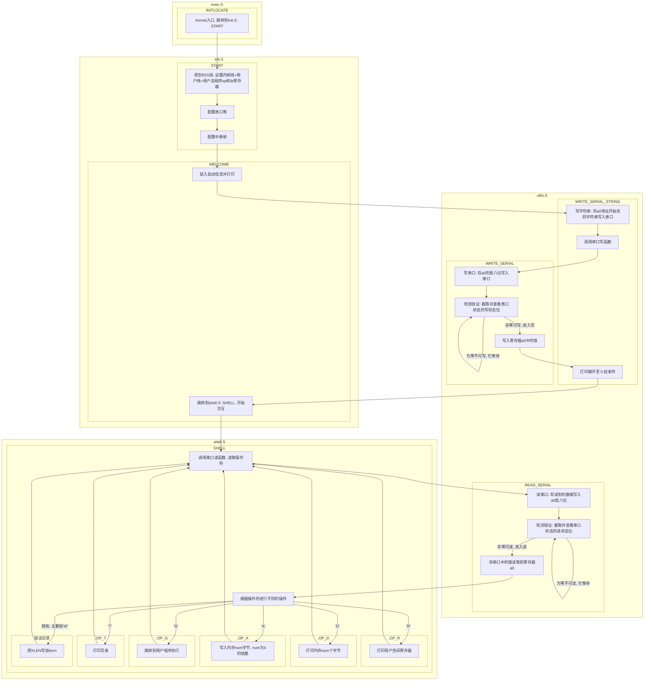
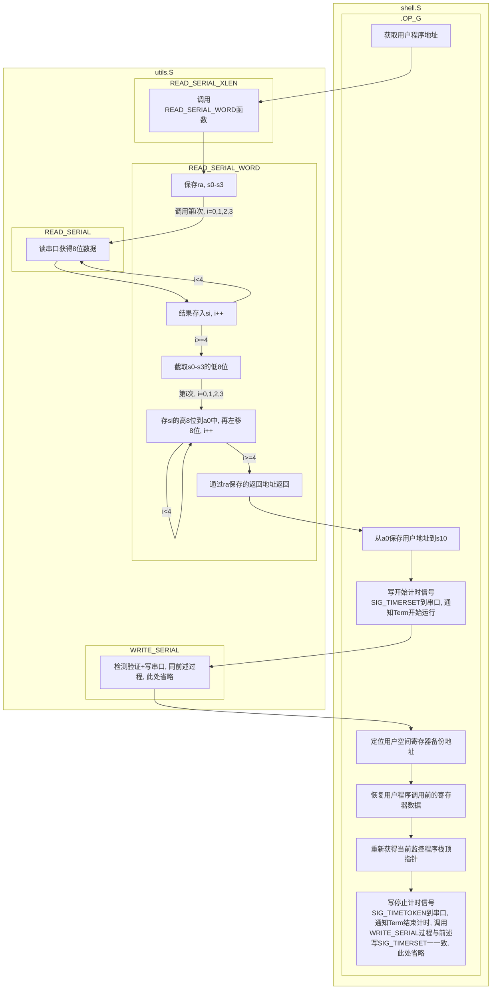
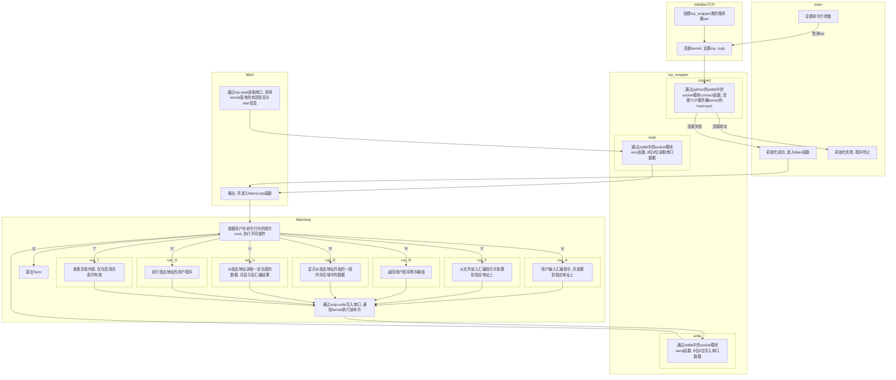

# 计组实验1：汇编语言与监控程序

## 实验报告

### 实验1：RISC-V监控程序与Term命令

在模拟器中运行 RISC-V 监控程序的基本步骤如下：

1. 启动监控程序

   

2. 通过终端连接监控程序

   

Term 中几个命令的使用方法（以下对每个命令的介绍均来自`supervisor-rv/`文件夹中的`README.md`文件）：

1. `R`：按照 x1 至 x31 的顺序返回用户程序寄存器值。

   

2. `D`：显示从指定地址开始的一段内存区域中的数据。

   

3. `A`：用户输入汇编指令，并放置到指定地址上

   

4. `F`：从文件读入汇编指令并放置到指定地址上，格式与 A 命令相同。

   

5. `U`：从指定地址读取一定长度的数据，并显示反汇编结果。

   

6. `G`：执行指定地址的用户程序。

   

7. `T`：查看页表内容，仅在启用页表时有效。

   

   加上flag`EN_PAGING=y`来启动监控程序，以启用页表（以下是部分页表内容截图）：

   

   

8. `Q`：退出 Term。

   

### 实验2：求前10个Fibonacci数

我的代码参考了`asmcode/`文件夹中`sum.s`与`fib-mem.s`代码。其中`sum.s`中采用循环的方式计算了$1 + 2 + ... + 10$，在我的代码中也参考了这一循环`loop`的书写方式，通过一个计数器`t3`来控制是否完成了`t4 = 10`次的计算循环（事实上只需要进行8次循环即可，因为前2项Fib数是既定已给出的，无需计算）。`fib-mem.s`中比较关键的则是Fib数递推的步骤：根据递推式计算下一个Fib数`add  t2, t0, t1  # t2 = t0+t1`，以及为下一轮递推做准备`ori  t0, t1, 0x0  # t0 = t1`, `ori  t1, t2, 0x0  # t1 = t2`，在我的代码中也参考了这一书写规范来进行Fib数的递推计算。

代码的总体思路分为以下几步：

1. 初始化加数（第一个Fib数`t0`，第二个Fib数`t1`），并设置好计数器相关变量（已计算次数`t3`、总共计算次数`t4`）、待写入地址`t5`；
2. 将前2个已知Fib数写入当前地址，并更新下一待写入地址；
3. 通过循环，以计算Fib递推式计算下一个Fib数`t2 = t0 + t1`，并在进入下一轮循环之前更新计算次数`t3`、待写入地址`t5`、新一轮递推的加数`t0`,` t1`，其中循环的终止条件为`t3 == t4`（即完成了`t4`次计算）；
4. 达到循环的终止条件（或不再满足循环的执行条件`t3 != t4`），返回，程序终止。

```bash
    .global _start
    .text

_start:

    li t0, 0x1   # t0 = 1，加数（第1个Fib数）
    li t1, 0x1   # t1 = 1，加数（第2个Fib数）
    li t3, 0x2   # 已计算次数，用于计数（前2项已给出）
    li t4, 0xA   # t4 = 10，一共需计算前10个Fib数
    li t5, 0x80400000  # 待写入的地址

    sw  t0, 0x0(t5)  # 将第1个Fib数写入地址
    sw  t1, 0x4(t5)  # 将第2个Fib数写入地址
    addi t5, t5, 0x8  # 待写入地址自增

loop:

    add t2, t0, t1   # t2 = t0 + t1，Fib数递推式
    addi t3, t3, 0x1  # t3++，已计算次数自增
    sw  t2, 0x0(t5)  # 将第t3个Fib数写入地址
    addi t5, t5, 0x4  # 待写入地址自增

    ori t0, t1, 0x0  # t0 = t1，为新一轮Fib数递推计算做准备
    ori t1, t2, 0x0  # t1 = t2，同上
    bne t3, t4, loop # 若没算完10个Fib数（t3 != t4），则通过loop继续计算
    nop
    jr ra            # 否则（t3 == t4）返回，程序终止
    nop
```

在`supervisor-rv/kernel/`目录下执行`make sim`启动监控程序，并在`supervisor-rv/term/`目录下执行`python3 term.py -t 127.0.0.1:6666`通过终端连接监控程序，并用`>> F`命令在监控程序中运行以上代码；通过`>> D`命令查看内存地址`0x80400000~0x80400024`，结果如下：


验证了存入起始地址为`0x80400000`的10个字中的数（16进制），与前10个Fibonacci数$1, 1, 2, 3, 5, 8, 13, 21, 34, 55$（十进制）一一对应，结果正确。

### 实验3：输出ASCII可见字符

我的代码参考了实验说明文档中提供的`WRITE_SERIAL`、`.TESTW`、`.WSERIAL`函数，以实现从终端输出字符。至于输出由`0x21`~`0x7E`共94个ASCII可见字符，采用循环的方式（94次循环）来进行输出，其中`a0`寄存器所存储的既是输出的对象（ASCII可见字符的十六进制编码）、又是计数器（由`0x21`开始计数到`0x7E`）。

代码的总体思路分为以下几步：

1. 初始化循环开始字符`a0`、结束字符`t2`，注意因为执行循环的边界条件判断为“不等”（`bne  a0, t2, WRITE_SERIAL  # a0 != t2 ` ）而非“小于等于”（`a0 <= t2`），因此结束字符`t2`需要额外加一；
2. 通过循环，向终端（`0x10000000`）输出`a0`寄存器中的最低字节，并在进入下一轮循环前更新`a0`的值（`a0++`，切换到下一顺位ASCII可见字符），其中循环的终止条件为`a0 == t2`（即完成了由`0x21`~`0x7E`所有ASCII可见字符的输出）；
3. 达到循环的终止条件（或不再满足循环的执行条件`a0 != t2`），返回，程序终止。

```bash
.section .text
.globl _start

_start:
    li  a0, 0x21      # 循环开始字符
    li  t2, 0x7E      # 循环结束字符
    addi t2, t2, 0x1  # .WSERIAL处bne边界条件

WRITE_SERIAL:
    # 串口地址是 0x10000000
    li t0, 0x10000000

    # 轮询串口状态（0x10000005）

.TESTW:
    lb t1, 5(t0)
    # 判断是否可写
    andi t1, t1, 0x20
    beq t1, zero, .TESTW

.WSERIAL:
    # 向终端（0x10000000）输出 a0 寄存器中的最低字节
    sb a0, 0(t0)

    addi a0, a0, 0x1          # a0++，切换到下一字符以输出
    bne a0, t2, WRITE_SERIAL  # 若未达到边界条件（a0 != t2）则继续输出ascii字符
    nop
    jr ra                     # 否则（a0 == t2）返回，终止程序
    nop
```

同样启动监控程序，并通过终端连接监控程序，在监控程序中运行以上代码，得到结果：


成功向终端输出了ASCII 可见字符：

```
!"#$%&'()*+,-./0123456789:;<=>?@ABCDEFGHIJKLMNOPQRSTUVWXYZ[\]^_`abcdefghijklmnopqrstuvwxyz{|}~
```

### 实验4：求第60个Fibonacci数

与实验2基本一致，但由于第60个Fibonacci数已经超过了32位整型，因此需要在实验2的基础上作出一些修改，主要区别如下：

1. 原先存储Fib数的3个32位寄存器`t0`、`t1`、`t2`，改由6个32位寄存器存储，其中每个64位的整数由2个32位寄存器储存，即`{a3, a2}`储存第一个Fib数、`{a5, a4}`储存第二个Fib数、`{a1, a0}`用来储存由Fib递推式计算得到的下一个Fib数（高位为`a3`、`a5`、`a1`，低位为`a2`、`a4`、`a0`）；
2. 计数器相关变量已计算次数`t3`保持一致，而总共计算次数`t4`由10（`0xA`）改为60（`0x3C`）；
3. 根据Fib递推式进行的加法运算，由原来的32位整型加法改为64位整型加法，此处参考了实验说明文档中提供的大位宽数据加法的实现方法；
4. 为新一轮Fib数递推计算做准备，赋值时注意要把两个Fib加数的高位、低位寄存器都赋值（因此由原本的两个语句变为四个语句，每个加数各有两个待更新的寄存器需要被赋值）；
5. 只需将第60个Fib数写入制定内存地址即可，因此不再需要每次循环都写入一次地址，而只需要在退出循环之后，执行一次第60个Fib数`{a1, a0}`的写入即可（注意低位`a0`写入`0x80400000`、高位`a1`写入`0x80400004`）。

```bash
    .global _start
    .text
    
_start:

    li a1, 0x0   # {a1, a0} = {0, 0}，初始化Fib数和
    li a0, 0x0
    li a3, 0x0   # {a3, a2} = {0, 1}，初始化Fib数加数（第1个Fib数为1）
    li a2, 0x1
    li a5, 0x0   # {a5, a4} = {0, 1}，初始化Fib数加数（第2个Fib数为1）
    li a4, 0x1

    li t3, 0x2   # 已计算次数，用于计数（前2项已给出）
    li t4, 0x3C  # t4 = 60，需计算到第60个Fib数
    li t5, 0x80400000  # 待写入的地址

loop:
    # {a3, a2} 即把低位保存在 a2，高位保存在 a3 的 64 位整数
    # {a3, a2} + {a5, a4} = {a1, a0}
    add a0, a2, a4
    sltu a2, a0, a2
    add a1, a3, a5
    add a1, a2, a1

    addi t3, t3, 0x1  # t3++，已计算次数自增

    ori a3, a5, 0x0   # {a3, a2} = {a5, a4}，为新一轮Fib数递推计算做准备
    ori a2, a4, 0x0
    ori a5, a1, 0x0   # {a5, a4} = {a1, a0}，同上
    ori a4, a0, 0x0

    bne t3, t4, loop  # 若没算到第60个Fib数（t3 != t4），则通过loop继续计算
    nop

    sw a0, 0x0(t5)    # 否则（t3 == t4）将第60个Fib数{a1, a0}写入地址
    sw a1, 0x4(t5)

    jr ra             # 返回，程序终止
    nop
```

同样启动监控程序，并通过终端连接监控程序，在监控程序中运行以上代码（方法与实验2、3均一致，此处省略），得到结果：


存入内存的结果`0x1686c8312d0`（十六进制）与第60个Fib数1548008755920（十进制）相同，结果正确。

## 代码分析报告

虽然在`supervisor-rv/README.md`文件中的“介绍”章节中写到“**监控程序**分为两个部分，**Kernel**和**Term**”，但鉴于实验说明文档中的要求是“撰写**监控程序**以及**终端程序**的代码分析报告”，以下均以实验说明文档中的说法为准，即**监控程序**代表**Kernel**、**终端程序**代表**Term**，而`README.md`文档中的“监控程序Supervisor”本质为一个简化的“**操作系统**”（即操作系统Supervisor分为监控程序Kernel和终端程序Term两个部分）。

在本次实验中，监控程序Kernel被运行在模拟环境QEMU中（QEMU模拟了RISC-V指令与系统，在后续实验中模拟环境QEMU将被物理实验平台替代），而我们需要通过终端程序Term与模拟环境QEMU中的监控程序Kernel进行交互，具体交互流程将在后续<a href="#1">交互流程</a>一节中阐释。以下将先分别给出监控程序Kernel与终端程序Term的代码分析。

### 监控程序Kernel

监控程序Kernel的代码在`supervisor-rv/kernal/`文件夹中：

```
.
├── Makefile（编译规则）
├── debug（调试指令）
├── include（头文件）
│   ├── common.h（基本信息如使用32位或64位架构使用的访存指令与地址位数、用户栈初始化、各信号相关常量等）
│   ├── exception.h（异常相关的常量）
│   └── serial.h（串口相关的常量）
├── kern（监控程序Kernel核心代码！！！）
│   ├── evec.S（监控程序入口点）
│   ├── init.S（监控程序初始化）
│   ├── kernel32.ld（32位RISC-V的链接文件）
│   ├── kernel64.ld（64位RISV-V的链接文件）
│   ├── shell.S（监控程序的交互功能实现）
│   ├── test.S（监控程序的性能测试程序）
│   ├── trap.S（监控程序中涉及中断相关代码）
│   └── utils.S（通过串口进行读、写数据相关代码）
├── kernel.asm（make编译Kernel程序后生成的文件）
├── kernel.bin（make编译Kernel程序后生成的文件）
├── kernel.elf（make编译Kernel程序后生成的文件）
└── obj/（内含make编译Kernel程序后生成的文件）
```

核心代码均在`kern/`文件夹中，其中涉及到本次实验基础版本Kernel的文件为 `evec.S` 、 `init.S` 、 `shell.S` 、 `utils.S` 这4个文件。程序的结构为：



由于`shell.S`中的具体操作（`R`、`D`、`A`、`G`、`T`）繁多，在上图中不一一分析具体实现方法，只取比较核心的`G`运行用户代码操作做详细分析，其代码结构如下（所有的循环`i = 0, 1, 2, 3`均是为了报告中书写方便，在实际代码中采用了直接书写四次代码实现）：



### 终端程序Term

终端程序的代码在`supervisor-rv/term/term.py`文件中，程序的结构为：




### 交互流程<a id="1"></a>

Kernel和Term通过串口进行交互，即用户在Term中输入的命令、代码在经过 Term 处理后通过串口传输给 Kernel，而Kernel需要输出的信息也会通过串口传输到Term并展示给用户。在这里是使用QEMU模拟串口，其地址如`README.md`文件所描述的：

>
> 设置了一个内存以外的地址区域，用于串口收发。串口控制器按照 [16550 UART 的寄存器](https://www.lammertbies.nl/comm/info/serial-uart) 的子集实现，访问的代码位于 `kern/utils.S` ，其部分数据格式为：
>
> | 地址 | 位 | 说明 |
> | --- | --- | --- |
> | `COM1` = 0x10000000 | [7:0] | 串口数据，读、写地址分别表示串口接收、发送一个字节 |
> | `COM1 + COM_LSR_OFFSET` = 0x10000005 | [5] | 只读，为1时表示串口空闲，可发送数据 |
> | `COM1 + COM_LSR_OFFSET` = 0x10000005 | [0] | 只读，为1时表示串口收到数据 |
>

意思是不论是Kernel要读写数据（从/给Term读/写），还是Term要读写数据（从/给Kernel读/写），二者均需要在判断`0x10000005`地址处的相关检验位（可写位是第`5`位，可读位是第`0`位）为1时，从`0x10000000`读/写8位的数据。一个重要的例子是，在前面针对监控程序Kernel的代码分析中，分析过的Term向Kernel发送用户代码的32位地址数据时（Term写、Kernel读），二者均需在判断可写/读时每次仅进行8位的数据交互，共4次，Kernel读到这4个8位的数据还需通过依次放入目标寄存器再左移的方法复原32位数据，实现完整的32位地址数据交互。

在Kernel中交互主要的代码块在`utils.S`中，包含向串口写入数据的 `WRITE_SERIAL` 、 `WRITE_SERIAL_WORD` 、 `WRITE_SERIAL_XLEN` 、 `WRITE_SERIAL_STRING` 函数，以及从串口读入数据的 `READ_SERIAL` 、 `READ_SERIAL_WORD` 、 `READ_SERIAL_XLEN` 函数。其中 `WRITE_SERIAL_WORD` 、 `WRITE_SERIAL_XLEN` 、 `WRITE_SERIAL_STRING` 均是基于 `WRITE_SERIAL` 函数（内部根据写出的数据大小，选择调用对应次数的 `WRITE_SERIAL` 函数），`READ_SERIAL_WORD` 、 `READ_SERIAL_XLEN` 均是基于 `READ_SERIAL` 函数（内部根据读入的数据大小，选择调用对应次数的 `WRITE_SERIAL` 函数）。对于串口地址、串口检验地址等常量均定义在`include/serial.h`中。

而 `WRITE_SERIAL` 和  `READ_SERIAL` 的核心内容，总结如下：

1. 判断检验位：将判断地址`0x10000005`处的数据通过`lb`指令读到`t1`寄存器中，再通过`andi`运算（`WRITE_SERIAL`中为`t1 = t1 & COM_LSR_THRE = t1 & 0x20` 即 `t1 = t1 & 0b00100000`截取第`5`位检验位是否可写；`READ_SERIAL`中为`t1 = t1 & COM_LSR_DR = t1 & 0x01`即 `t1 = t1 & 0b00000001`截取第`1`为检验位是否可读）截取检验位并判断是否可写/可读（可写/可读计算为1，不可写/不可读为0）；
2. 根据检验位的合法性决定下一步执行动作（条件跳转`bne`）：若检验位不合法（为0）则通过循环判断检验位代码的方法实现“忙等待”，不断“轮询串口状态”直到合法（为1）；若检验位合法（为1）则直接顺序执行后面的代码（真正执行读/写到串口的代码）；
3. 读/写：通过`sb`（`WRITE_SERIAL`，写）、`lb`（`READ_SERIAL`，读）向/从串口地址`0x10000000`读/写数据。

这种通过 `sb`、`lb` 等内存访问指令来实现的对于串口的访问，实际是访问的外设寄存器，这种访问方式叫做MMIO（内存映射 IO）。

在Term中交互主要的代码块在`term.py`文件里`class tcp_wrapper`中定义的`write`函数与`read`函数，函数实现是基于Python的stdlib库中`socket`模块的`send`、`recv`函数。虽然不确定`socket`模块的`send`、`recv`函数具体是如何实现的，但根据Kernel在`utils.S`中的读 `READ_SERIAL` /写 `WRITE_SERIAL` 函数每次只读取/写入`0x10000000`地址8位数据，推测Term中调用的`socket`模块的`send`、`recv`函数也需要判断检验位后每次向串口地址`0x10000000`读/写8位数据。

## 思考题目

1. **比较 RISC-V 指令寻址方法与 x86 指令寻址方法的异同。**

   RISC-V指令寻址方法只有一种（立即数与存放基址的寄存器相加，即基址+偏移量寻址），而x86指令寻址方法繁多（包含立即数寻址、寄存器寻址、绝对寻址、间接寻址、基址+偏移量寻址、2种变址寻址、4种比例变址寻址）。

   RISC-V只有load, store访存指令（`lb`, `lw`, `sb`, `sw`等）可以访问内存，而x86基本所有指令（如移动指令`mov`、算术指令`add`等，以及x86本身的访存指令）均可以访问内存。

2. **阅读监控程序，列出监控程序的 19 条指令，请根据自己的理解对用到的指令进行分类，并说明分类原因。**

   19条指令（参考了*《RISC-V手册》*）：

   | 指令                     | 描述                                          | 具体含义                                                     |
   | :----------------------- | :-------------------------------------------- | :----------------------------------------------------------- |
   | **add** rd, rs1, rs2     | x[rd] = x[rs1] + x[rs2]                       | 把寄存器 x[rs2]加到寄存器x[rs1]上，结果写入x[rd]（忽略算术溢出） |
   | **addi** rd, rs, imm     | x[rd] = x[rs] + sext(imm)                     | 把符号位扩展的立即数加到寄存器x[rs]上，结果写入x[rd]（忽略算术溢出） |
   | **and** rd, rs1, rs2     | x[rd] = x[rs1] & x[rs2]                       | 将寄存器 x[rs1]和寄存器x[rs2]位与的结果写入x[rd]             |
   | **andi** rd, rs, imm     | x[rd] = x[rs] & sext(imm)                     | 把符号位扩展的立即数和寄存器x[rs]上的值进行位与，结果写入x[rd] |
   | **auipc** rd, imm        | x[rd] = pc + sext(imm[31:12] << 12)           | 把符号位扩展的20位（左移12位）立即数加到pc上，结果写入x[rd]  |
   | **beq** rs1, rs2, offset | if (x[rs1] == x[rs2]) pc += sext(offset)      | 若寄存器x[rs1]和寄存器x[rs2]的值相等，把pc的值设为当前值加上符号位扩展的偏移offset |
   | **bne** rs1, rs2, offset | if (x[rs1] ≠ x[rs2]) pc += sext(offset)       | 若寄存器x[rs1]和寄存器x[rs2]的值不相等，把pc的值设为当前值加上符号位扩展的偏移offset |
   | **jal** rd, offset       | x[rd] = pc+4; pc += sext(offset)              | 把下一条指令的地址(pc+4)写入x[rd]，然后把pc设置为当前值加上符号位扩展的offset |
   | **jalr** rd, offset(rs)  | t=pc+4; pc=(x[rs]+sext(offset))&~1; x[rd]=t   | 把pc设置为x[rs]+sext(offset)，把计算出的地址的最低有效位设为 0，并将原pc+4的值写入x[rd]（rd默认为x1） |
   | **lb** rd, offset(rs)    | x[rd] = sext(M\[x[rs] + sext(offset)\][7:0])  | 从地址x[rs]+sext(offset)读取一个字节（8位），经符号位扩展后写入x[rd] |
   | **lui** rd, imm          | x[rd] = sext(imm[31:12] << 12)                | 将符号位扩展的20位立即数imm左移12位，写入x[rd]中（低12位置零） |
   | **lw** rd, offset(rs)    | x[rd] = sext(M\[x[rs] + sext(offset)\][31:0]) | 从地址x[rs]+sext(offset)读取四个字节，写入x[rd]              |
   | **or** rd, rs1, rs2      | x[rd] = x[rs1] \| x[rs2]                      | 把寄存器x[rs1]和寄存器x[rs2]按位取或，结果写入x[rd]          |
   | **ori** rd, rs, imm      | x[rd] = x[rs] \| sext(imm)                    | 把寄存器x[rs]和符号扩展的立即数imm按位取或，结果写入x[rd]    |
   | **sb** rs2, offset(rs1)  | M[x[rs1] + sext(offset)] = x\[rs2][7:0]       | 将x[rs2]的低8位存入内存地址x[rs1]+sext(offset)               |
   | **slli** rd, rs, shamt   | x[rd] = x[rs] << shamt                        | 把寄存器x[rs]逻辑左移shamt位，空出的位置填入0，结果写入x[rd]（对于RV32I，仅当shamt[5]=0时，指令才有效） |
   | **srli** rd, rs, shamt   | x[rd] = x[rs] >> shamt                        | 把寄存器x[rs]逻辑右移shamt位，空出的位置填入0，结果写入x[rd]（对于RV32I，仅当shamt[5]=0时，指令才有效） |
   | **sw** rs2, offset(rs1)  | M[x[rs1] + sext(offset)] = x\[rs2][31:0]      | 将x[rs2]的低位4个字节存入内存地址x[rs1]+sext(offset)         |
   | **xor** rd, rs1, rs2     | x[rd] = x[rs1] ^ x[rs2]                       | x[rs1]和x[rs2]按位异或，结果写入x[rd]                        |

    > *x[id]表示编号为id的寄存器，rd表示destination register目标寄存器的编号，rs表示source register源寄存器的编号，sext表示sign-extend符号位扩展，imm表示immediate立即数，pc表示program counter程序计数器寄存器，offset为立即数形式的偏移量，M[address]表示地址为address的内存空间，shamt为立即数形式的位移量。*

   分类：

   | 分类           | 指令                                                       | 原因                                                         |
   | -------------- | ---------------------------------------------------------- | ------------------------------------------------------------ |
   | 整数计算指令   | ADD, ADDI, AND, ANDI, SLLI, SRLI, OR, ORI, XOR, LUI, AUIPC | 需要调用ALU，包含算术指令（ADD, ADDI）、逻辑指令（AND, ANDI, OR, ORI, XOR）、移位指令（SLLI, SRLI）、其他（向PC高位加上立即数的AUIPC, 加载立即数到高位的LUI） |
   | 条件分支指令   | BEQ, BNE                                                   | 根据比较结果进行分支跳转                                     |
   | 无条件跳转指令 | JAL, JALR                                                  | 实现无条件的跳转并链接                                       |
   | 访存指令       | LB, LW, SB, SW                                             | 从/向内存加载、存储数据                                      |

3. **结合 term 源代码和 kernel 源代码说明 term 是如何实现用户程序计时的。**

   主要思路是，Kernel获得用户程序地址后通过串口发送开始计时信号`SIG_TIMERSET`来通知Term用户程序开始运行，Term处开始计时（记录开始时间），Kernel执行完用户程序并复原调用用户代码前的寄存器、栈顶指针后通过串口发送停止计时信号`SIG_TIMETOKEN`来通知Term用户程序结束运行，Term处停止计时并获得用户程序运行时间（计算结束时间与先前记录的开始时间之差）。

   具体流程为：

   1. Term在`term.py`文件中的`run_G`函数中，将指令`G`与用户程序代码所在的8位内存地址通过串口写给Kernel；
   2. Kernel在`shell.S`文件的`SHELL`函数中从串口中读入Term发来的`G`指令并跳转到`.OP_G`子函数中，再从串口中读入Term发来的用户程序代码所在的8位内存地址并保存到`s10`寄存器，然后在执行用户程序（跳转到`s10`所存内存地址处）之前，通过串口向Term写入开始计时信号`SIG_TIMERSET`（即`0x06`，在ASCII中表示ACK，为不可见ASCII字符）；
   3. Term通过串口读入Kernel发来的数据，并判断是否为约定好的开始计时信号`SIG_TIMERSET`（即`0x06`），若是则通过`time_start = timer()`开始计时（记录开始时间）；
   4. Kernel此时写入返回地址`la ra, .USERRET2`到`ra`后开始执行用户程序，即`jr s10`跳转到用户程序所在的内存地址`s10`处，同时Term通过`while True:`循环不断判断从串口处读入的数据是否是约定好的停止计时信号`SIG_TIMETOKEN`（即`0x07`，在ASCII中表示BEL，为不可见ASCII字符）——
   5. 若Term读入的不是停止计时信号`SIG_TIMETOKEN`（且也不是超时信号`SIG_TIMEOUT`即`0x81 `）则默认为Kernel向Term发送的待输出到终端的可见字符，调用`output_binary`函数将其输出到终端；
   6. 直到Kernel执行完用户程序（进入`.USERRET2`子函数并完成调用用户程序之前的寄存器、栈顶指针复原），通过串口向Term写入停止计时信号`SIG_TIMETOKEN`；
   7. 因此此时Term再通过`while`循环从串口读入的就是停止计时信号`SIG_TIMETOKEN`（即`0x07`），终止`while`循环并通过`elapse = timer() - time_start`停止计时并获得用户程序运行时间（计算结束时间与先前记录的开始时间之差）。

4. **说明 kernel 是如何使用串口的（在源代码中，这部分有针对 FPGA 与 QEMU 两个版本的代码，任选其一进行分析即可）。**

   如`supervisor-rv/kernel/include/serial.h`文件中定义的，FPGA与QEMU的串口地址常量均由`COM1`表示、串口的寄存器地址间隔均由`COM_MULTIPLY`表示、串口是否可读/可写的判断地址相对于串口地址的偏移量均由`COM_LSR_OFFSET`表示（即判断可读/可写状态位的判断地址实际为`COM1 + COM_LSR_OFFSET`）、写状态位均由`COM_LSR_THRE`表示、读状态位均由`COM_LSR_DR`表示。

   详见上一章代码分析报告中<a href="#1">交互流程</a>一节，以QEMU为例（即`COM1 = 0x10000000`, `COM_MULTIPLY = 1`, ` COM_LSR_OFFSET = 5`, `COM_LSR_THRE = 0x20`, `COM_LSR_DR = 0x01`）分析了Kernel如何使用串。（FPGA相应的各常量为`COM1 = AXI Uart16550的基地址 + 0x10000`, `COM_MULTIPLY = 4`, ` COM_LSR_OFFSET = 20`, `COM_LSR_THRE = 0x20`, `COM_LSR_DR = 0x01`）。

5. **请问 term 如何检查 kernel 已经正确连入，并分别指出检查代码在 term 与 kernel 源码中的位置。**

   检查代码在Term源码中的`term.py`文件`main`函数调用`InitializeTCP`函数中`ser.connect(host, int(port))`语句，其中`ser`是类`tcp_wrapper`的对象，`tcp_wrapper`的成员函数`connect`内部实际上调用了Python的stdlib库中socket模块所定义的`connect`函数。

   检查代码在Kernel源码中的`shell.S`文件`SHELL`函数`li a0, XLEN`与`jal WRITE_SERIAL`指令（后续又跳转到`utils.S`文件`WRITE_SERIAL`函数以将`XLEN`写入串口给Term）。

   Term如何检查Kernel已经正确连入，分析如下——

   观察Term连接Kernel的过程：

   ```bash
   ➜  kernel git:(master) ✗ make sim
   riscv64-unknown-elf-ld  obj/evec.o  obj/init.o  obj/shell.o  obj/test.o  obj/trap.o  obj/utils.o -Tkern/kernel32.ld
   qemu-system-riscv32 -M virt -m 32M -kernel kernel.elf -nographic -monitor none -serial tcp::6666,server -s -bios none
   qemu-system-riscv32: -serial tcp::6666,server: info: QEMU waiting for connection on: disconnected:tcp::::6666,server=on
   ```

   ```bash
   ➜  term git:(master) ✗ python3 term.py -t 127.0.0.1:6666
   connecting to 127.0.0.1:6666...connected
   MONITOR for RISC-V - initialized.
   running in 32bit, xlen = 4
   >>
   ```

   完整连接过程（包含**检查是否正确连入**）分为以下几步：

   1. 一旦启动Kernel（执行`make sim`指令），Kernel就已经完成`evec.S`与`init.S`中代码的运行（此处包含①各种必要的初始化，②通过模拟器QEMU设置好的host为本机、端口为`6666`的TCP服务器以等待Term的连接并配置好串口，③以及向串口写入定义为`monitor_version`的文本数据`"MONITOR for RISC-V - initialized."`——注意此处只是向串口写入，Term并没有读取该数据，Term甚至还没有连接上Kernel呢），并进入`shell.S`中`SHELL`函数中，第一行的`jal READ_SERIAL`跳转到`utils.S`的读操作符函数中，忙等待Term在连接上Kernel之后通过串口向Kernel发送操作符`W`，好让Kernel通过串口把`XLEN`写给Term（注意此处Kernel一直卡在函数`READ_SERIAL`中的子函数`.TESTR`进行轮询检测验证，因为Term此时还没给Kernel发送任何数据，因此串口检测地址的可读位始终为0，Term甚至还没连接上Kernel呢）；
   2. 反观Term，由用户在终端敲入`python3 term.py -t 127.0.0.1:6666`命令，Term在`term.py`的`main`函数中通过`args = parser.parse_args()`从命令行读入`args.tcp = 127.0.0.1:6666 `，并作为参数`host_port`传入`InitializeTCP(host_port)`函数；
   3. 在`InitializeTCP`函数中，若用户输入的`host_port`不满足`host`与`port`的正则表达式，则直接返回到`main`函数中输出`print('Failed to establish TCP connection')`退出程序，也就是完全没有执行任何连接相关操作；
   4. 若用户输入的`host_port`在语法上是合法的，则Term创建`tcp_wrapper`类的`ser = tcp_wrapper()`对象，在终端输出`"connecting to 127.0.0.1:6666..."`，并调用`socket`模块（Python的stdlib库自带模块）的`ser.connect(host, int(port))`连接函数进行连接与**检查是否正确连入**的操作（若连接成功则顺序执行`print("connected")`输出连接成功，若连接失败则由`socket`库的`connect`函数提供报错信息如`ConnectionRefusedError: [Errno 61] Connection refused`并退出程序）；
   5. 连接成功后（终端输出`"connected"`），Term跳转到`Main`函数，通过`inp.read`从串口中读入步骤1.中Kernel往串口中写入的`monitor_version`文本数据，并打印在终端；
   6. 然后Term再向串口`outp.write(b'W')`写入操作符`W`，如步骤1.所提到的，Kernel在`READ_SERIAL`函数中的子函数`.TESTR`轮询进行检测验证，终于验证到了可读位为1（因为Term终于向Kernel发送了数据`W`，串口检测地址的可读位从0变成1），顺序执行读取操作符`W`，并返回到`SHELL`函数中，执行`li a0, XLEN`与`jal WRITE_SERIAL`，即将机器字长`XLEN`（版本号）通过串口写给Term，该功能作为**检查是否正确连入**的标志，之后Kernel将等待Term从串口发来的Term命令；
   7. Term读取串口`xlen = ord(inp.read(1))`获得机器字长并输出到终端`"running in 32bit, xlen = 4"`，随后进入`MainLoop`函数由用户输入Term命令，后续再与Kernel交互，不再阐释。

1. **比较 RISC-V 指令寻址方法与 x86 指令寻址方法的异同。**

   RISC-V指令寻址方法只有一种（立即数与存放基址的寄存器相加，即基址+偏移量寻址），而x86指令寻址方法繁多（包含立即数寻址、寄存器寻址、绝对寻址、间接寻址、基址+偏移量寻址、2种变址寻址、4种比例变址寻址）。

   RISC-V只有load, store访存指令（`lb`, `lw`, `sb`, `sw`等）可以访问内存，而x86基本所有指令（如移动指令`mov`、算术指令`add`等，以及x86本身的访存指令）均可以访问内存。

2. **阅读监控程序，列出监控程序的 19 条指令，请根据自己的理解对用到的指令进行分类，并说明分类原因。**

   19条指令（参考了*《RISC-V手册》*）：

   | 指令                     | 描述                                          | 具体含义                                                     |
   | :----------------------- | :-------------------------------------------- | :----------------------------------------------------------- |
   | **add** rd, rs1, rs2     | x[rd] = x[rs1] + x[rs2]                       | 把寄存器 x[rs2]加到寄存器x[rs1]上，结果写入x[rd]（忽略算术溢出） |
   | **addi** rd, rs, imm     | x[rd] = x[rs] + sext(imm)                     | 把符号位扩展的立即数加到寄存器x[rs]上，结果写入x[rd]（忽略算术溢出） |
   | **and** rd, rs1, rs2     | x[rd] = x[rs1] & x[rs2]                       | 将寄存器 x[rs1]和寄存器x[rs2]位与的结果写入x[rd]             |
   | **andi** rd, rs, imm     | x[rd] = x[rs] & sext(imm)                     | 把符号位扩展的立即数和寄存器x[rs]上的值进行位与，结果写入x[rd] |
   | **auipc** rd, imm        | x[rd] = pc + sext(imm[31:12] << 12)           | 把符号位扩展的20位（左移12位）立即数加到pc上，结果写入x[rd]  |
   | **beq** rs1, rs2, offset | if (x[rs1] == x[rs2]) pc += sext(offset)      | 若寄存器x[rs1]和寄存器x[rs2]的值相等，把pc的值设为当前值加上符号位扩展的偏移offset |
   | **bne** rs1, rs2, offset | if (x[rs1] ≠ x[rs2]) pc += sext(offset)       | 若寄存器x[rs1]和寄存器x[rs2]的值不相等，把pc的值设为当前值加上符号位扩展的偏移offset |
   | **jal** rd, offset       | x[rd] = pc+4; pc += sext(offset)              | 把下一条指令的地址(pc+4)写入x[rd]，然后把pc设置为当前值加上符号位扩展的offset |
   | **jalr** rd, offset(rs)  | t=pc+4; pc=(x[rs]+sext(offset))&~1; x[rd]=t   | 把pc设置为x[rs]+sext(offset)，把计算出的地址的最低有效位设为 0，并将原pc+4的值写入x[rd]（rd默认为x1） |
   | **lb** rd, offset(rs)    | x[rd] = sext(M\[x[rs] + sext(offset)\][7:0])  | 从地址x[rs]+sext(offset)读取一个字节（8位），经符号位扩展后写入x[rd] |
   | **lui** rd, imm          | x[rd] = sext(imm[31:12] << 12)                | 将符号位扩展的20位立即数imm左移12位，写入x[rd]中（低12位置零） |
   | **lw** rd, offset(rs)    | x[rd] = sext(M\[x[rs] + sext(offset)\][31:0]) | 从地址x[rs]+sext(offset)读取四个字节，写入x[rd]              |
   | **or** rd, rs1, rs2      | x[rd] = x[rs1] \| x[rs2]                      | 把寄存器x[rs1]和寄存器x[rs2]按位取或，结果写入x[rd]          |
   | **ori** rd, rs, imm      | x[rd] = x[rs] \| sext(imm)                    | 把寄存器x[rs]和符号扩展的立即数imm按位取或，结果写入x[rd]    |
   | **sb** rs2, offset(rs1)  | M[x[rs1] + sext(offset)] = x\[rs2][7:0]       | 将x[rs2]的低8位存入内存地址x[rs1]+sext(offset)               |
   | **slli** rd, rs, shamt   | x[rd] = x[rs] << shamt                        | 把寄存器x[rs]逻辑左移shamt位，空出的位置填入0，结果写入x[rd]（对于RV32I，仅当shamt[5]=0时，指令才有效） |
   | **srli** rd, rs, shamt   | x[rd] = x[rs] >> shamt                        | 把寄存器x[rs]逻辑右移shamt位，空出的位置填入0，结果写入x[rd]（对于RV32I，仅当shamt[5]=0时，指令才有效） |
   | **sw** rs2, offset(rs1)  | M[x[rs1] + sext(offset)] = x\[rs2][31:0]      | 将x[rs2]的低位4个字节存入内存地址x[rs1]+sext(offset)         |
   | **xor** rd, rs1, rs2     | x[rd] = x[rs1] ^ x[rs2]                       | x[rs1]和x[rs2]按位异或，结果写入x[rd]                        |

    > *x[id]表示编号为id的寄存器，rd表示destination register目标寄存器的编号，rs表示source register源寄存器的编号，sext表示sign-extend符号位扩展，imm表示immediate立即数，pc表示program counter程序计数器寄存器，offset为立即数形式的偏移量，M[address]表示地址为address的内存空间，shamt为立即数形式的位移量。*

   分类：

   | 分类           | 指令                                                       | 原因                                                         |
   | -------------- | ---------------------------------------------------------- | ------------------------------------------------------------ |
   | 整数计算指令   | ADD, ADDI, AND, ANDI, SLLI, SRLI, OR, ORI, XOR, LUI, AUIPC | 需要调用ALU，包含算术指令（ADD, ADDI）、逻辑指令（AND, ANDI, OR, ORI, XOR）、移位指令（SLLI, SRLI）、其他（向PC高位加上立即数的AUIPC, 加载立即数到高位的LUI） |
   | 条件分支指令   | BEQ, BNE                                                   | 根据比较结果进行分支跳转                                     |
   | 无条件跳转指令 | JAL, JALR                                                  | 实现无条件的跳转并链接                                       |
   | 访存指令       | LB, LW, SB, SW                                             | 从/向内存加载、存储数据                                      |

3. **结合 term 源代码和 kernel 源代码说明 term 是如何实现用户程序计时的。**

   主要思路是，Kernel获得用户程序地址后通过串口发送开始计时信号`SIG_TIMERSET`来通知Term用户程序开始运行，Term处开始计时（记录开始时间），Kernel执行完用户程序并复原调用用户代码前的寄存器、栈顶指针后通过串口发送停止计时信号`SIG_TIMETOKEN`来通知Term用户程序结束运行，Term处停止计时并获得用户程序运行时间（计算结束时间与先前记录的开始时间之差）。

   具体流程为：

   1. Term在`term.py`文件中的`run_G`函数中，将指令`G`与用户程序代码所在的8位内存地址通过串口写给Kernel；
   2. Kernel在`shell.S`文件的`SHELL`函数中从串口中读入Term发来的`G`指令并跳转到`.OP_G`子函数中，再从串口中读入Term发来的用户程序代码所在的8位内存地址并保存到`s10`寄存器，然后在执行用户程序（跳转到`s10`所存内存地址处）之前，通过串口向Term写入开始计时信号`SIG_TIMERSET`（即`0x06`，在ASCII中表示ACK，为不可见ASCII字符）；
   3. Term通过串口读入Kernel发来的数据，并判断是否为约定好的开始计时信号`SIG_TIMERSET`（即`0x06`），若是则通过`time_start = timer()`开始计时（记录开始时间）；
   4. Kernel此时写入返回地址`la ra, .USERRET2`到`ra`后开始执行用户程序，即`jr s10`跳转到用户程序所在的内存地址`s10`处，同时Term通过`while True:`循环不断判断从串口处读入的数据是否是约定好的停止计时信号`SIG_TIMETOKEN`（即`0x07`，在ASCII中表示BEL，为不可见ASCII字符）——
   5. 若Term读入的不是停止计时信号`SIG_TIMETOKEN`（且也不是超时信号`SIG_TIMEOUT`即`0x81 `）则默认为Kernel向Term发送的待输出到终端的可见字符，调用`output_binary`函数将其输出到终端；
   6. 直到Kernel执行完用户程序（进入`.USERRET2`子函数并完成调用用户程序之前的寄存器、栈顶指针复原），通过串口向Term写入停止计时信号`SIG_TIMETOKEN`；
   7. 因此此时Term再通过`while`循环从串口读入的就是停止计时信号`SIG_TIMETOKEN`（即`0x07`），终止`while`循环并通过`elapse = timer() - time_start`停止计时并获得用户程序运行时间（计算结束时间与先前记录的开始时间之差）。

4. **说明 kernel 是如何使用串口的（在源代码中，这部分有针对 FPGA 与 QEMU 两个版本的代码，任选其一进行分析即可）。**

   如`supervisor-rv/kernel/include/serial.h`文件中定义的，FPGA与QEMU的串口地址常量均由`COM1`表示、串口的寄存器地址间隔均由`COM_MULTIPLY`表示、串口是否可读/可写的判断地址相对于串口地址的偏移量均由`COM_LSR_OFFSET`表示（即判断可读/可写状态位的判断地址实际为`COM1 + COM_LSR_OFFSET`）、写状态位均由`COM_LSR_THRE`表示、读状态位均由`COM_LSR_DR`表示。

   详见上一章代码分析报告中<a href="#1">交互流程</a>一节，以QEMU为例（即`COM1 = 0x10000000`, `COM_MULTIPLY = 1`, ` COM_LSR_OFFSET = 5`, `COM_LSR_THRE = 0x20`, `COM_LSR_DR = 0x01`）分析了Kernel如何使用串。（FPGA相应的各常量为`COM1 = AXI Uart16550的基地址 + 0x10000`, `COM_MULTIPLY = 4`, ` COM_LSR_OFFSET = 20`, `COM_LSR_THRE = 0x20`, `COM_LSR_DR = 0x01`）。

5. **请问 term 如何检查 kernel 已经正确连入，并分别指出检查代码在 term 与 kernel 源码中的位置。**

   检查代码在Term源码中的`term.py`文件`main`函数调用`InitializeTCP`函数中`ser.connect(host, int(port))`语句，其中`ser`是类`tcp_wrapper`的对象，`tcp_wrapper`的成员函数`connect`内部实际上调用了Python的stdlib库中socket模块所定义的`connect`函数。

   检查代码在Kernel源码中的`shell.S`文件`SHELL`函数`li a0, XLEN`与`jal WRITE_SERIAL`指令（后续又跳转到`utils.S`文件`WRITE_SERIAL`函数以将`XLEN`写入串口给Term）。

   Term如何检查Kernel已经正确连入，分析如下——

   观察Term连接Kernel的过程：

   ```bash
   ➜  kernel git:(master) ✗ make sim
   riscv64-unknown-elf-ld  obj/evec.o  obj/init.o  obj/shell.o  obj/test.o  obj/trap.o  obj/utils.o -Tkern/kernel32.ld
   qemu-system-riscv32 -M virt -m 32M -kernel kernel.elf -nographic -monitor none -serial tcp::6666,server -s -bios none
   qemu-system-riscv32: -serial tcp::6666,server: info: QEMU waiting for connection on: disconnected:tcp::::6666,server=on
   ```

   ```bash
   ➜  term git:(master) ✗ python3 term.py -t 127.0.0.1:6666
   connecting to 127.0.0.1:6666...connected
   MONITOR for RISC-V - initialized.
   running in 32bit, xlen = 4
   >>
   ```

   完整连接过程（包含**检查是否正确连入**）分为以下几步：

   1. 一旦启动Kernel（执行`make sim`指令），Kernel就已经完成`evec.S`与`init.S`中代码的运行（此处包含①各种必要的初始化，②通过模拟器QEMU设置好的host为本机、端口为`6666`的TCP服务器以等待Term的连接并配置好串口，③以及向串口写入定义为`monitor_version`的文本数据`"MONITOR for RISC-V - initialized."`——注意此处只是向串口写入，Term并没有读取该数据，Term甚至还没有连接上Kernel呢），并进入`shell.S`中`SHELL`函数中，第一行的`jal READ_SERIAL`跳转到`utils.S`的读操作符函数中，忙等待Term在连接上Kernel之后通过串口向Kernel发送操作符`W`，好让Kernel通过串口把`XLEN`写给Term（注意此处Kernel一直卡在函数`READ_SERIAL`中的子函数`.TESTR`进行轮询检测验证，因为Term此时还没给Kernel发送任何数据，因此串口检测地址的可读位始终为0，Term甚至还没连接上Kernel呢）；
   2. 反观Term，由用户在终端敲入`python3 term.py -t 127.0.0.1:6666`命令，Term在`term.py`的`main`函数中通过`args = parser.parse_args()`从命令行读入`args.tcp = 127.0.0.1:6666 `，并作为参数`host_port`传入`InitializeTCP(host_port)`函数；
   3. 在`InitializeTCP`函数中，若用户输入的`host_port`不满足`host`与`port`的正则表达式，则直接返回到`main`函数中输出`print('Failed to establish TCP connection')`退出程序，也就是完全没有执行任何连接相关操作；
   4. 若用户输入的`host_port`在语法上是合法的，则Term创建`tcp_wrapper`类的`ser = tcp_wrapper()`对象，在终端输出`"connecting to 127.0.0.1:6666..."`，并调用`socket`模块（Python的stdlib库自带模块）的`ser.connect(host, int(port))`连接函数进行连接与**检查是否正确连入**的操作（若连接成功则顺序执行`print("connected")`输出连接成功，若连接失败则由`socket`库的`connect`函数提供报错信息如`ConnectionRefusedError: [Errno 61] Connection refused`并退出程序）；
   5. 连接成功后（终端输出`"connected"`），Term跳转到`Main`函数，通过`inp.read`从串口中读入步骤1.中Kernel往串口中写入的`monitor_version`文本数据，并打印在终端；
   6. 然后Term再向串口`outp.write(b'W')`写入操作符`W`，如步骤1.所提到的，Kernel在`READ_SERIAL`函数中的子函数`.TESTR`轮询进行检测验证，终于验证到了可读位为1（因为Term终于向Kernel发送了数据`W`，串口检测地址的可读位从0变成1），顺序执行读取操作符`W`，并返回到`SHELL`函数中，执行`li a0, XLEN`与`jal WRITE_SERIAL`，即将机器字长`XLEN`（版本号）通过串口写给Term，该功能作为**检查是否正确连入**的标志，之后Kernel将等待Term从串口发来的Term命令；
   7. Term读取串口`xlen = ord(inp.read(1))`获得机器字长并输出到终端`"running in 32bit, xlen = 4"`，随后进入`MainLoop`函数由用户输入Term命令，后续再与Kernel交互，不再阐释。
