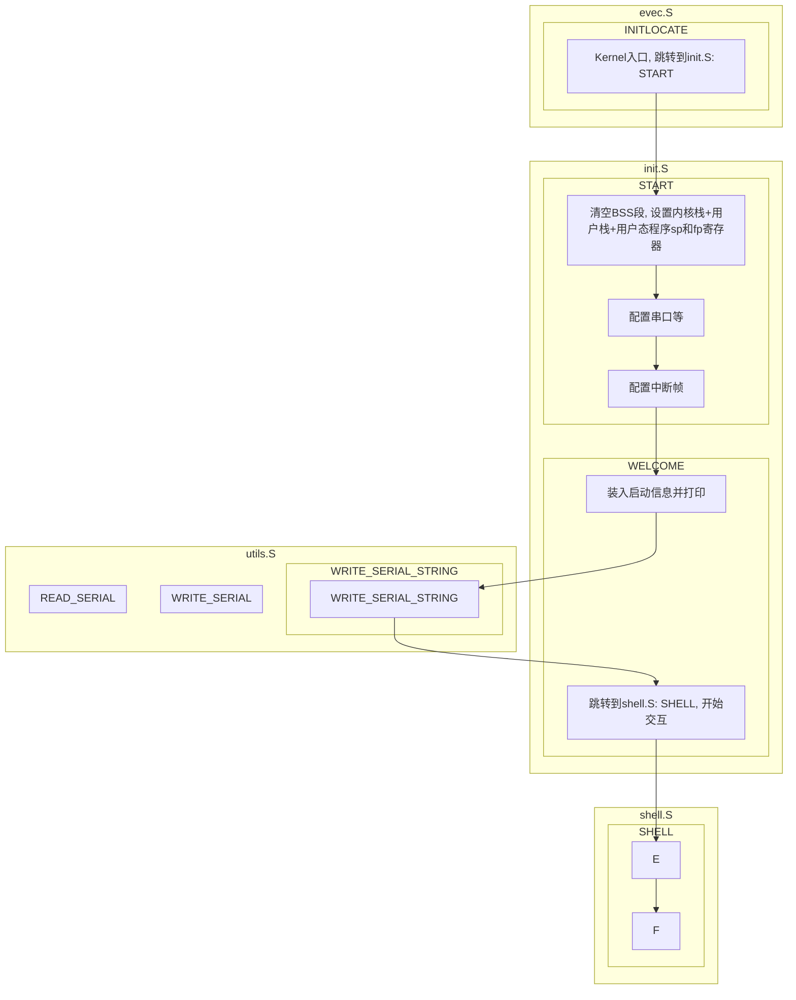

## 实验报告

### 实验1：RISC-V监控程序与Term命令

在模拟器中运行 RISC-V 监控程序的基本步骤如下：

1. 启动监控程序

   

2. 通过终端连接监控程序

   

Term 中几个命令的使用方法（以下对每个命令的介绍均来自`supervisor-rv/`文件夹中的`README.md`文件）：

1. `R`：按照 x1 至 x31 的顺序返回用户程序寄存器值。

   

2. `D`：显示从指定地址开始的一段内存区域中的数据。

   

3. `A`：用户输入汇编指令，并放置到指定地址上

   

4. `F`：从文件读入汇编指令并放置到指定地址上，格式与 A 命令相同。

   

5. `U`：从指定地址读取一定长度的数据，并显示反汇编结果。

   

6. `G`：执行指定地址的用户程序。

   

7. `T`：查看页表内容，仅在启用页表时有效。

   

   加上flag`EN_PAGING=y`来启动监控程序，以启用页表（以下是部分页表内容截图）：

   

   

8. `Q`：退出 Term。

   

### 实验2：求前10个Fibonacci数

我的代码参考了`asmcode/`文件夹中`sum.s`与`fib-mem.s`代码。其中`sum.s`中采用循环的方式计算了$1 + 2 + ... + 10$，在我的代码中也参考了这一循环`loop`的书写方式，通过一个计数器`t3`来控制是否完成了`t4 = 10`次的计算循环（事实上只需要进行8次循环即可，因为前2项Fib数是既定已给出的，无需计算）。`fib-mem.s`中比较关键的则是Fib数递推的步骤：根据递推式计算下一个Fib数`add  t2, t0, t1  # t2 = t0+t1`，以及为下一轮递推做准备`ori  t0, t1, 0x0  # t0 = t1`, `ori  t1, t2, 0x0  # t1 = t2`，在我的代码中也参考了这一书写规范来进行Fib数的递推计算。

代码的总体思路分为以下几步：

1. 初始化加数（第一个Fib数`t0`，第二个Fib数`t1`），并设置好计数器相关变量（已计算次数`t3`、总共计算次数`t4`）、待写入地址`t5`；
2. 将前2个已知Fib数写入当前地址，并更新下一待写入地址；
3. 通过循环，以计算Fib递推式计算下一个Fib数`t2 = t0 + t1`，并在进入下一轮循环之前更新计算次数`t3`、待写入地址`t5`、新一轮递推的加数`t0`,` t1`，其中循环的终止条件为`t3 == t4`（即完成了`t4`次计算）；
4. 达到循环的终止条件（或不再满足循环的执行条件`t3 != t4`），返回，程序终止。

```bash
    .global _start
    .text

_start:

    li t0, 0x1   # t0 = 1，加数（第1个Fib数）
    li t1, 0x1   # t1 = 1，加数（第2个Fib数）
    li t3, 0x2   # 已计算次数，用于计数（前2项已给出）
    li t4, 0xA   # t4 = 10，一共需计算前10个Fib数
    li t5, 0x80400000  # 待写入的地址

    sw  t0, 0x0(t5)  # 将第1个Fib数写入地址
    sw  t1, 0x4(t5)  # 将第2个Fib数写入地址
    addi t5, t5, 0x8  # 待写入地址自增

loop:

    add t2, t0, t1   # t2 = t0 + t1，Fib数递推式
    addi t3, t3, 0x1  # t3++，已计算次数自增
    sw  t2, 0x0(t5)  # 将第t3个Fib数写入地址
    addi t5, t5, 0x4  # 待写入地址自增

    ori t0, t1, 0x0  # t0 = t1，为新一轮Fib数递推计算做准备
    ori t1, t2, 0x0  # t1 = t2，同上
    bne t3, t4, loop # 若没算完10个Fib数（t3 != t4），则通过loop继续计算
    nop
    jr ra            # 否则（t3 == t4）返回，程序终止
    nop
```

在`supervisor-rv/kernel/`目录下执行`make sim`启动监控程序，并在`supervisor-rv/term/`目录下执行`python3 term.py -t 127.0.0.1:6666`通过终端连接监控程序，并用`>> F`命令在监控程序中运行以上代码；通过`>> D`命令查看内存地址`0x80400000~0x80400024`，结果如下：


验证了存入起始地址为`0x80400000`的10个字中的数（16进制），与前10个Fibonacci数$1, 1, 2, 3, 5, 8, 13, 21, 34, 55$（十进制）一一对应，结果正确。

### 实验3：输出ASCII可见字符

我的代码参考了实验说明文档中提供的`WRITE_SERIAL`、`.TESTW`、`.WSERIAL`函数，以实现从终端输出字符。至于输出由`0x21`~`0x7E`共94个ASCII可见字符，采用循环的方式（94次循环）来进行输出，其中`a0`寄存器所存储的既是输出的对象（ASCII可见字符的十六进制编码）、又是计数器（由`0x21`开始计数到`0x7E`）。

代码的总体思路分为以下几步：

1. 初始化循环开始字符`a0`、结束字符`t2`，注意因为执行循环的边界条件判断为“不等”（`bne  a0, t2, WRITE_SERIAL  # a0 != t2 ` ）而非“小于等于”（`a0 <= t2`），因此结束字符`t2`需要额外加一；
2. 通过循环，向终端（`0x10000000`）输出`a0`寄存器中的最低字节，并在进入下一轮循环前更新`a0`的值（`a0++`，切换到下一顺位ASCII可见字符），其中循环的终止条件为`a0 == t2`（即完成了由`0x21`~`0x7E`所有ASCII可见字符的输出）；
3. 达到循环的终止条件（或不再满足循环的执行条件`a0 != t2`），返回，程序终止。

```bash
.section .text
.globl _start

_start:
    li  a0, 0x21      # 循环开始字符
    li  t2, 0x7E      # 循环结束字符
    addi t2, t2, 0x1  # .WSERIAL处bne边界条件

WRITE_SERIAL:
    # 串口地址是 0x10000000
    li t0, 0x10000000

    # 轮询串口状态（0x10000005）

.TESTW:
    lb t1, 5(t0)
    # 判断是否可写
    andi t1, t1, 0x20
    beq t1, zero, .TESTW

.WSERIAL:
    # 向终端（0x10000000）输出 a0 寄存器中的最低字节
    sb a0, 0(t0)

    addi a0, a0, 0x1          # a0++，切换到下一字符以输出
    bne a0, t2, WRITE_SERIAL  # 若未达到边界条件（a0 != t2）则继续输出ascii字符
    nop
    jr ra                     # 否则（a0 == t2）返回，终止程序
    nop
```

同样启动监控程序，并通过终端连接监控程序，在监控程序中运行以上代码，得到结果：


成功向终端输出了ASCII 可见字符：
```text
!"#$%&'()*+,-./0123456789:;<=>?@ABCDEFGHIJKLMNOPQRSTUVWXYZ[]^_`abcdefghijklmnopqrstuvwxyz{|}~
```

### 实验4：求第60个Fibonacci数

与实验2基本一致，但由于第60个Fibonacci数已经超过了32位整型，因此需要在实验2的基础上作出一些修改，主要区别如下：

1. 原先存储Fib数的3个32位寄存器`t0`、`t1`、`t2`，改由6个32位寄存器存储，其中每个64位的整数由2个32位寄存器储存，即`{a3, a2}`储存第一个Fib数、`{a5, a4}`储存第二个Fib数、`{a1, a0}`用来储存由Fib递推式计算得到的下一个Fib数（高位为`a3`、`a5`、`a1`，低位为`a2`、`a4`、`a0`）；
2. 计数器相关变量已计算次数`t3`保持一致，而总共计算次数`t4`由10（`0xA`）改为60（`0x3C`）；
3. 根据Fib递推式进行的加法运算，由原来的32位整型加法改为64位整型加法，此处参考了实验说明文档中提供的大位宽数据加法的实现方法；
4. 为新一轮Fib数递推计算做准备，赋值时注意要把两个Fib加数的高位、低位寄存器都赋值（因此由原本的两个语句变为四个语句，每个加数各有两个待更新的寄存器需要被赋值）；
5. 只需将第60个Fib数写入制定内存地址即可，因此不再需要每次循环都写入一次地址，而只需要在退出循环之后，执行一次第60个Fib数`{a1, a0}`的写入即可（注意低位`a0`写入`0x80400000`、高位`a1`写入`0x80400004`）。

```bash
    .global _start
    .text
    
_start:

    li a1, 0x0   # {a1, a0} = {0, 0}，初始化Fib数和
    li a0, 0x0
    li a3, 0x0   # {a3, a2} = {0, 1}，初始化Fib数加数（第1个Fib数为1）
    li a2, 0x1
    li a5, 0x0   # {a5, a4} = {0, 1}，初始化Fib数加数（第2个Fib数为1）
    li a4, 0x1

    li t3, 0x2   # 已计算次数，用于计数（前2项已给出）
    li t4, 0x3C  # t4 = 60，需计算到第60个Fib数
    li t5, 0x80400000  # 待写入的地址

loop:
    # {a3, a2} 即把低位保存在 a2，高位保存在 a3 的 64 位整数
    # {a3, a2} + {a5, a4} = {a1, a0}
    add a0, a2, a4
    sltu a2, a0, a2
    add a1, a3, a5
    add a1, a2, a1

    addi t3, t3, 0x1  # t3++，已计算次数自增

    ori a3, a5, 0x0   # {a3, a2} = {a5, a4}，为新一轮Fib数递推计算做准备
    ori a2, a4, 0x0
    ori a5, a1, 0x0   # {a5, a4} = {a1, a0}，同上
    ori a4, a0, 0x0

    bne t3, t4, loop  # 若没算到第60个Fib数（t3 != t4），则通过loop继续计算
    nop

    sw a0, 0x0(t5)    # 否则（t3 == t4）将第60个Fib数{a1, a0}写入地址
    sw a1, 0x4(t5)

    jr ra             # 返回，程序终止
    nop
```

同样启动监控程序，并通过终端连接监控程序，在监控程序中运行以上代码（方法与实验2、3均一致，此处省略），得到结果：


存入内存的结果`0x1686c8312d0`（十六进制）与第60个Fib数1548008755920（十进制）相同，结果正确。

## 代码分析报告

虽然在`supervisor-rv/README.md`文件中的“介绍”章节中写到“**监控程序**分为两个部分，**Kernel**和**Term**”，但鉴于实验说明文档中的要求是“撰写**监控程序**以及**终端程序**的代码分析报告”，以下均以实验说明文档中的说法为准，即**监控程序**代表**Kernel**、**终端程序**代表**Term**，而`README.md`文档中的“监控程序Supervisor”本质为一个简化的“**操作系统**”（即操作系统Supervisor分为监控程序Kernel和终端程序Term两个部分）。

在本次实验中，监控程序Kernel被运行在模拟环境QEMU中（QEMU模拟了RISC-V指令与系统，在后续实验中模拟环境QEMU将被物理实验平台替代），而我们需要通过终端程序Term与模拟环境QEMU中的监控程序Kernel进行交互，具体交互流程将在后续“交互流程”章节中阐释。以下将先分别给出监控程序Kernel与终端程序Term的代码分析。

### 监控程序Kernel

监控程序Kernel的代码在`supervisor-rv/kernal/`文件夹中：

```bash
.
├── Makefile（编译规则）
├── debug（调试指令）
├── include（头文件）
│   ├── common.h（基本信息如使用32位或64位架构使用的访存指令与地址位数、用户栈初始化、各信号相关常量等）
│   ├── exception.h（异常相关的常量）
│   └── serial.h（串口相关的常量）
├── kern（监控程序Kernel核心代码！！！）
│   ├── evec.S（监控程序入口点）
│   ├── init.S（监控程序初始化）
│   ├── kernel32.ld（32位RISC-V的链接文件）
│   ├── kernel64.ld（64位RISV-V的链接文件）
│   ├── shell.S（监控程序的交互功能实现）
│   ├── test.S（监控程序的性能测试程序）
│   ├── trap.S（监控程序中涉及中断相关代码）
│   └── utils.S（通过串口进行读、写数据相关代码）
├── kernel.asm（make编译Kernel程序后生成的文件）
├── kernel.bin（make编译Kernel程序后生成的文件）
├── kernel.elf（make编译Kernel程序后生成的文件）
└── obj/（内含make编译Kernel程序后生成的文件）
```

核心代码均在`kern/`文件夹中，其中涉及到本次实验基础版本Kernel的文件为 `evec.S` 、 `init.S` 、 `shell.S` 、 `utils.S` 这4个文件。程序的结构大致为：



evec.S

监控程序的入口点，是最先执行的代码

.text.init 段放在内存的 0x80000000 位置

跳转到 init.S:START

init.S

清空 BSS，_sbss 和 _ebss 在 ld script 中定义（kernel32.ld、kernel64.ld）

设置内核栈、用户栈、用户态程序的 sp(x2) 和 fp(x8) 寄存器，uregs_sp 和 uregs_fp 在 ld script 中定义（kernel32.ld、kernel64.ld）


### 终端程序Term

终端程序的代码在`supervisor-rv/term/`文件夹中，

程序的结构

### 交互流程

程序与外部交互的流程（描述清楚交互核心的逻辑、主要的代码块，核心是理解kernel如何和term进行通讯的）

建议完整阅读并理解kernel的代码

监控程序类似于一个简化的操作系统，能够完成简单的接收输入命令，执行命令并输出结果的流程。监控程序也作为最后的大实验的检验标准，即大实验需要正确运行监控程序。

计算机组成原理的实验最终目的是设计并实现一个能够完成基本功能的**处理器**，并**驱动内存**以及**串口**来运行一个简化的操作系统（"**监控程序 Supervisor**"）。为了能够和监控程序进行交互，还需要**终端程序（Term）**与监控程序通过串口进行交互。ThinPad 开发板提供现场可编程门阵列（FPGA），内存，以及串口。实验的工作是编写一个 RISC-V 处理器，将其装载到 FPGA 中。完成之后的处理器将执行监控程序，并与终端程序交互。监控程序保存在内存中。


模拟环境，监控程序，终端程序关系

课程组提供能够执行监控程序的模拟环境。模拟环境基于 QEMU，模拟了 RISC-V 的指令功能以及基于 RISC-V 的系统，可以运行监控程序。终端程序也可以与模拟环境中的监控程序进行交互。模拟环境模拟了真实的硬件执行情况，可作为大实验正确性的对比。

如果将监控程序运行在模拟环境中，则模拟环境替代了物理实验平台，监控程序保存在模拟内存中，模拟的 RISC-V 处理器执行监控程序。QEMU 模拟的 RISC-V 处理器包括了完整的指令集，自然也包括了在实验中需要实现的指令。模拟的处理器会模拟监控程序的每一条指令的执行，并依据指令的功能去驱动模拟的串口，或者完成对模拟内存的读写。模拟串口的行为和实际串口是一致的，也可以和终端程序进行交互。实验最终设计实现的处理器执行监控程序应当获得相同的效果。


参考实验说明文档中的常见问题回答，kernel 和 term 之间的连接关系是需要通过串口的，而串口有自己的协议，并且按照协议来工作。可以直接把串口想象成一条信号线。如果通过模拟器来运行 kernel，那么 qemu 模拟器就起到了模拟硬件的作用。qemu 模拟器会对内（针对 kernel）模拟出来一个串口，对外则启动了一个网络服务器，这样就使得监控程序可以和 qemu 模拟的串口进行交互。整个系统的连接情况如下图所示：


看一下 util.S 的代码。对于串口的访问来说，虽然是通过 sb,lb 等内存访问指令来进行的，而实际上是访问的外设寄存器（这样的访问方式叫做内存映射 IO，MMIO: Memory Mapped IO），对应的内存单元是不会被访问到的。每次访问之前都需要先读一下标志寄存器，看看是不是已经准备好。例如，term 发一个字符到串口的时候，流程如下所示：

（1）Term 发一个字符到 qemu。（qemu 会模拟出来一个 tcp 的服务端。）

（2）QEMU 收到一个字符后，放到模拟串口的缓冲器里面，一个字节（可以用一个内存变量来模拟串口的数据寄存器）

（3）QEMU 之后把对应的串口状态寄存器（可以用一个内存变量来模拟）标志位设置为 1。

上面就是模拟器的工作，而模拟器对应实际的硬件，实际硬件也是这么做的。

随后，kernel 程序会先对读测试一下 test_read，再去读的话就会读到状态寄存器的值。这个时候发现标志位为 1，下一步就可以直接从数据寄存器读数据了（使用 lb）。

有很多同学可能没有系统的经验，先理解上面的图以及工作流程之后再动手。和其它同学进行讨论是加快理解的好办法。

再加一个图，说明用户程序和系统剩下部分的关系：


用户程序需要执行的时候，需要通过 Kernel 来执行的。需要先把用户程序写入到内存中，然后再通过 G 命令执行。另外，基本版的监控程序没有保护，小心不要写入到内核的程序空间中，也要小心保护好 ra 寄存器，免得跳不会监控程序（一般不再调用新的函数不会）。

串口是一个外设。计算机处理器控制外设，一般是对外设寄存器进行读写。外设寄存器一般会不止一个，因此需要对外设寄存器进行编址（或者说，给不同的名称）。对于 x86 来说，对外设寄存器的读写是通过 in/out 指令来进行读写的。对于 mmio 这样的结构来说，就通过通常的内存访问指令来的。但是，无论是哪种情况，都是对外设寄存器的读写。外设寄存器一般有状态寄存器，控制寄存器，数据寄存器等。显然，状态寄存器是将自己的状态汇报给处理器的，是只读的。数据寄存器用来和处理器之间交换数据的。控制寄存器是控制外设的行为的。当外设看到控制寄存器发生变化的时候，就可以做出相应的动作。这些是基本的原理。上面部分的内容大家可以画个图，仔细体会一下（前面的图可以参考，在界面部分加上几个寄存器即可。）有这部分理解之后，就可以回答实验一的提问了。

代码部分有两个地方，一个地方在 include/serial.h

另外一个地方是 init.S 下面部分的代码

QEMU 会完善模拟 uart 的工作，而 FPGA 是我们自己做的，配合 lb,sb 工作。

# 思考题目

1. 比较 RISC-V 指令寻址方法与 x86 指令寻址方法的异同。

   RISC-V指令寻址方法只有直接寻址，而x86指令寻址方法包含直接寻址与间接寻址。

   RISC-V只有load、store指令（lb, lw, sb, sw）可以访问内存（寻址），而x86基本所有指令（如移动指令mov、算术指令add等，以及x86本身的访存指令）均可以访问内存（寻址）。

2. 阅读监控程序，列出监控程序的 19 条指令，请根据自己的理解对用到的指令进行分类，并说明分类原因。

   19条指令：

   | 指令                     | 描述                                          | 具体含义                                                     |
   | ------------------------ | :-------------------------------------------- | ------------------------------------------------------------ |
   | **add** rd, rs1, rs2     | x[rd] = x[rs1] + x[rs2]                       | 把寄存器 x[rs2]加到寄存器x[rs1]上，结果写入x[rd]（忽略算术溢出） |
   | **addi** rd, rs, imm     | x[rd] = x[rs] + sext(imm)                     | 把符号位扩展的立即数加到寄存器x[rs]上，结果写入x[rd]（忽略算术溢出） |
   | **and** rd, rs1, rs2     | x[rd] = x[rs1] & x[rs2]                       | 将寄存器 x[rs1]和寄存器x[rs2]位与的结果写入x[rd]             |
   | **andi** rd, rs, imm     | x[rd] = x[rs] & sext(imm)                     | 把符号位扩展的立即数和寄存器x[rs]上的值进行位与，结果写入x[rd] |
   | **auipc** rd, imm        | x[rd] = pc + sext(imm[31:12] << 12)           | 把符号位扩展的20位（左移12位）立即数加到pc上，结果写入x[rd]  |
   | **beq** rs1, rs2, offset | if (x[rs1] == x[rs2]) pc += sext(offset)      | 若寄存器x[rs1]和寄存器x[rs2]的值相等，把pc的值设为当前值加上符号位扩展的偏移offset |
   | **bne** rs1, rs2, offset | if (x[rs1] ≠ x[rs2]) pc += sext(offset)       | 若寄存器x[rs1]和寄存器x[rs2]的值不相等，把pc的值设为当前值加上符号位扩展的偏移offset |
   | **jal** rd, offset       | x[rd] = pc+4; pc += sext(offset)              | 把下一条指令的地址(pc+4)写入x[rd]，然后把pc设置为当前值加上符号位扩展的offset |
   | **jalr** rd, offset(rs)  | t=pc+4; pc=(x[rs]+sext(offset))&~1; x[rd]=t   | 把pc设置为x[rs]+sext(offset)，把计算出的地址的最低有效位设为 0，并将原pc+4的值写入x[rd]（rd默认为x1） |
   | **lb** rd, offset(rs)    | x[rd] = sext(M\[x[rs] + sext(offset)\][7:0])  | 从地址x[rs]+sext(offset)读取一个字节（8位），经符号位扩展后写入x[rd] |
   | **lui** rd, imm          | x[rd] = sext(imm[31:12] << 12)                | 将符号位扩展的20位立即数imm左移12位，写入x[rd]中（低12位置零） |
   | **lw** rd, offset(rs)    | x[rd] = sext(M\[x[rs] + sext(offset)\][31:0]) | 从地址x[rs]+sext(offset)读取四个字节，写入x[rd]              |
   | **or** rd, rs1, rs2      | x[rd] = x[rs1] \| x[rs2]                      |                                                              |
   | **ori**                  |                                               |                                                              |
   | **sb**                   |                                               |                                                              |
   | **slli**                 |                                               |                                                              |
   | **srli**                 |                                               |                                                              |
   | **sw**                   |                                               |                                                              |
   | **xor**                  |                                               |                                                              |

    *x[id]表示编号为id的寄存器，rd表示destination register目标寄存器的编号，rs表示source register源寄存器的编号，sext表示sign-extend符号位扩展，imm表示immediate立即数，pc表示program counter程序计数器寄存器，offset为立即数形式的偏移量，M[address]表示地址为address的内存空间*

   分类：

   AUIPC? LUI? 为了跳转到/移动12位以上立即数（最高32位）需要将跳转/移动指令拆解成AUIPC/LUI与另一指令

   算术、逻辑操作是否要合并？

   比较、无条件跳转是否要合并？

   读取、写入内存是否要合并？

   | 分类       | 指令                                | 理由 |
   | ---------- | ----------------------------------- | ---- |
   | 算术操作   | ADD, ADDI                           |      |
   | 逻辑操作   | AND, ANDI, SLLI, SRLI, OR, ORI, XOR |      |
   | 比较跳转   | BEQ, BNE                            |      |
   | 无条件跳转 | JAL, JALR                           |      |
   | 读取内存   | LB, LW                              |      |
   | 写入内存   | SB, SW                              |      |

3. 结合 term 源代码和 kernel 源代码说明 term 是如何实现用户程序计时的。

4. 说明 kernel 是如何使用串口的（在源代码中，这部分有针对 FPGA 与 QEMU 两个版本的代码，任选其一进行分析即可）。

5. 请问 term 如何检查 kernel 已经正确连入，并分别指出检查代码在 term 与 kernel 源码中的位置。